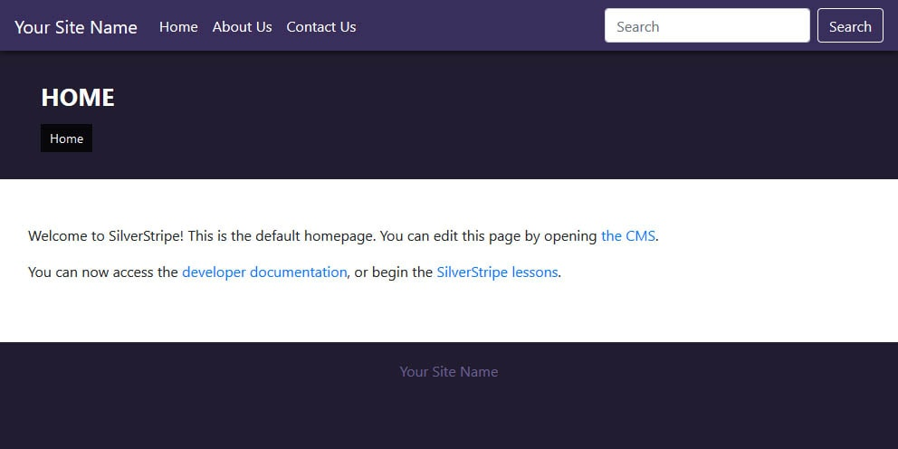

# SilverStripe 4 Theme - RetroWave


## Installation
**Via Composer**
```
composer require isaacdanielreyna/retrowave-theme
```
## Configuring theme
After installing, update the current theme in SilverStripe. Edit **app/_config/theme.yml** and add retrowave-theme
```
---
Name: mytheme
---
SilverStripe\View\SSViewer:
  themes:
    - '$public'
    - 'retrowave-theme'
    - '$default'
SilverStripe\i18n\i18n:
  default_locale: 'en_US'
```